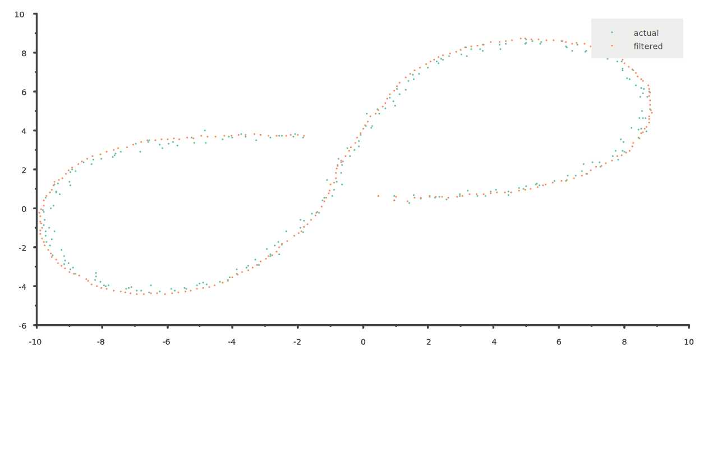

# 2D Position and Velocity Kalman Filter


 2D Kalman filter for position and velocity estimation.

## Dependencies

* [Eigen3](https://eigen.tuxfamily.org/index.php?title=Main_Page)
* Tests require sciplot to visualize the output. you can install it from here [sciplot](https://github.com/sciplot/sciplot).
* Python module requires [pybind11](https://github.com/pybind/pybind11)


## How to build

`mkdir build && cd build && cmake .. && make`

## How to use in C++

```c++
/**
 * @brief Construct a new Kalman Filter object
 *
 * @param noise_ax the variance of ax squared.
 * @param noise_ay the variance of ay squared.
 * @param z_cov_x measurement covariance in x.
 * @param z_cov_y measurement covariance in y.
 */
KalmanFilter kf(3, 3, 0.2, 0.2);
/**
 * @brief Measurements update function.
 *
 * @param z Eigen::VectorXd Measurements vector (2x1).
 * @param timestamp Measurements Timestamp.
 * @param bearing If True we will use EKF and the measurement should be
 * (range,angle).
 * @param us True if the timestamp in microseconds, false if it's in
 * nanoseconds.
 */
kf.Update(z, timestamp, false, true);
/**
* @brief Get the states vector.
*
* @return const VectorXd
*/
auto x = kf.GetX();

```

## How to use in Python

make sure that `kalmanfilter.cpython-36m-x86_64-linux-gnu.so` is in your path.

```python
import kalmanfilter
kf = kalmanfilter.KalmanFilter(3, 3, 0.2, 0.2)
kf.Update(z, timestamp, false, true)
x = kf.GetX()
```